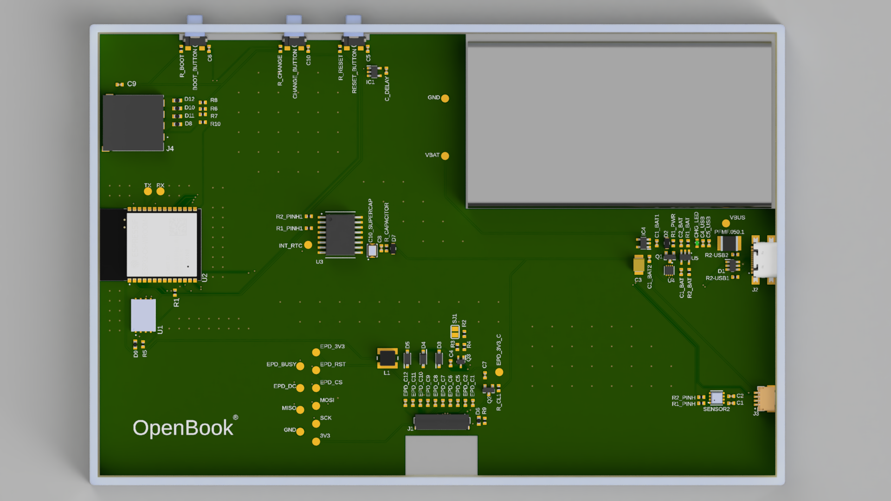
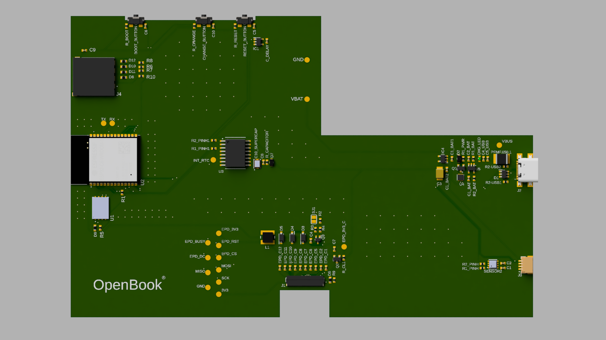
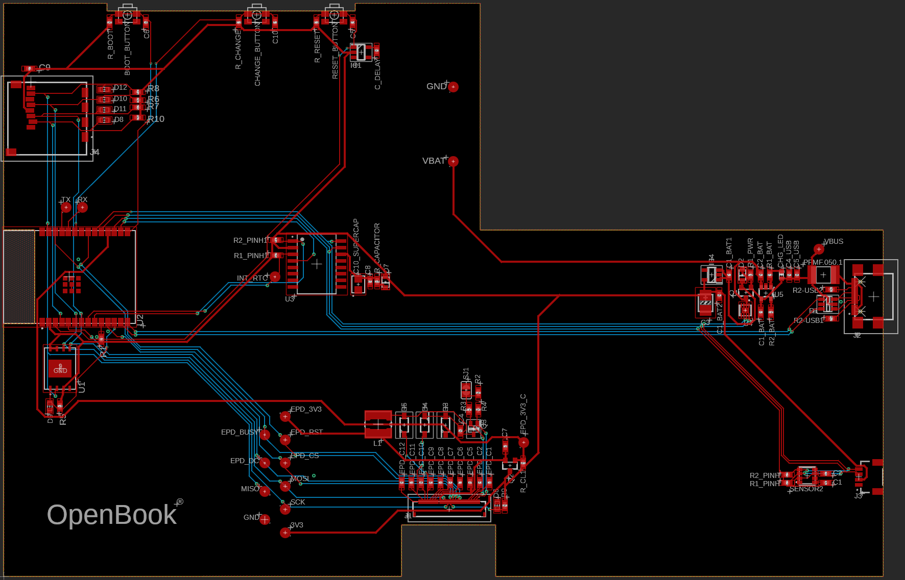
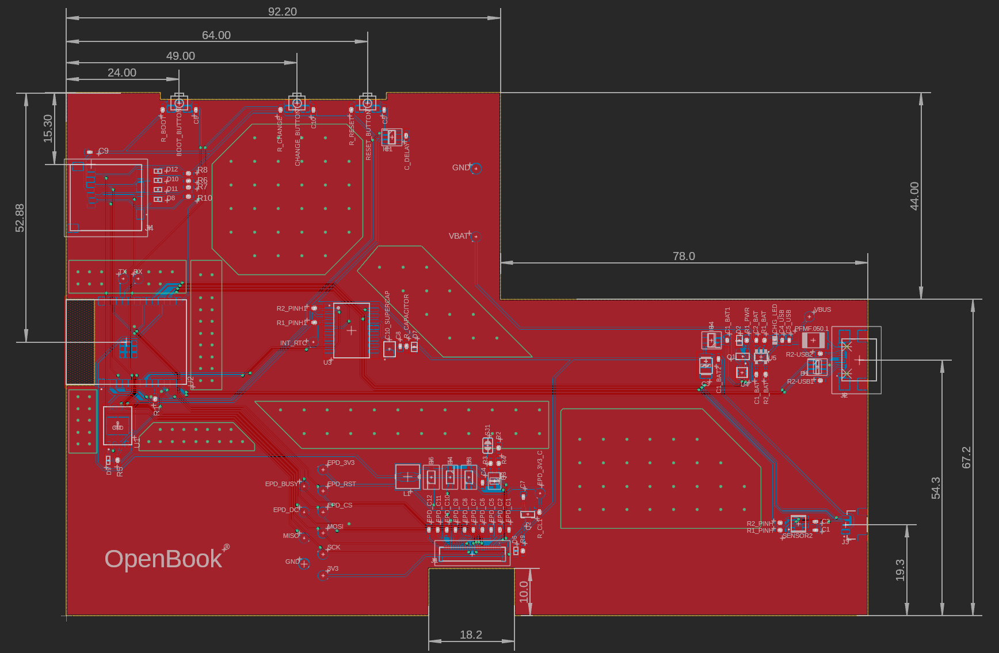

Moroianu Horia-Valentin

# OpenBook

## Diagrama bloc

## Prezentare Generala

Dispozitivul este construit in jurul microcontrolerului **ESP32-C6-WROOM-1-N8**, o componenta performanta ce ofera conectivitate Wi-Fi 6, Bluetooth 5 LE si o arhitectura RISC-V eficienta energetic. Acesta coordoneaza toate componentele periferice prin magistralele **SPI** si **I2C**.

Pentru masurarea timpului, este integrat un modul **RTC DS3231SN**, conectat prin I2C si semnale auxiliare pentru intreruperi si ceas. Pe aceeasi magistrala I2C functioneaza si senzorul **BME688**, responsabil pentru monitorizarea temperaturii, umiditatii, presiunii si compusilor din aer.

Datele pot fi stocate atat pe un **card SD** (SPI), cat si intr-o memorie **Flash NOR de 64MB**, utilizata pentru firmware. Afisajul grafic este realizat printr-un **ePaper Display**, conectat prin SPI, cu pini de control suplimentari pentru functionare eficienta.

Alimentarea este asigurata de un port **USB-C** cu protectie ESD, in combinatie cu un stabilizator **LDO** de 3.3V. Incarcarea bateriei Li-Po este gestionata de un circuit **MCP73831**, iar starea bateriei este monitorizata cu ajutorul unui **MAX17048**, controlat prin I2C.

Dispozitivul include si un conector **Qwiic/Stemma QT**, facilitand extinderea cu senzori compatibili I2C. Butoanele hardware permit controlul direct al functiilor de IO: resetare, boot si control.

## Conectivitate ESP32-C6

| Pin ESP32-C6   | Componenta Asociata                  | Functie                              |
|----------------|--------------------------------------|--------------------------------------|
| IO0            | RTC - DS3231SN                       | INT_RTC (Interrupt)                  |
| IO1            | RTC - DS3231SN                       | Semnal 32KHz                         |
| IO2            | SD Card, ePaper, Flash               | SPI - MISO                           |
| IO3            | ePaper Display                       | EPD BUSY                             |
| IO4            | SD Card                              | SPI - CS                             |
| IO5            | ePaper Display                       | D/C (Data/Command)                   |
| IO6            | SD Card, ePaper, Flash               | SPI - SCK                            |
| IO7            | SD Card, ePaper, Flash               | SPI - MOSI                           |
| IO9            | Buton Boot                           | IO/BOOT                              |
| IO10           | ePaper Display                       | SPI - CS                             |
| IO11           | Flash                                | SPI - Flash CS                       |
| IO12           | USB                                  | USB D−                               |
| IO13           | USB                                  | USB D+                               |
| IO15           | Buton CHANGE                         | IO/CHANGE                            |
| IO16           | Testpad                              | UART TX Debugg                       |
| IO17           | Testpad                              | UART RX Debugg                       |
| IO18           | RTC - DS3231SN                       | RTC Reset                            |
| IO19           | BME688                               | I2C power line                       |
| IO20           | ePaper Display                       | EPD Power supply                     |
| IO21           | RTC, BME688, Qwiic                   | I2C - SDA                            |
| IO22           | RTC, BME688, Qwiic                   | I2C - SCL                            |
| IO23           | ePaper Display                       | Reset                                |
| EN             | Buton Reset                          | IO/RESET                             |
| 3V3            | Toate modulele                       | Alimentare 3.3V                      |
| GND            | Toate modulele                       | Masa                                 |

## BOM

| Componenta            | Sursa                                                                                                                                                                                              | Datasheet                                                                                                                                  | Descriere          |
| ----------------------- | ---------------------------------------------------------------------------------------------------------------------------------------------------------------------------------------------------- | -------------------------------------------------------------------------------------------------------------------------------------------- | -------------------- |
| XC6220A331MR-G        | [Product Page](https://ro.mouser.com/ProductDetail/Torex-Semiconductor/XC6220A331MR-G?qs=AsjdqWjXhJ8ZSWznL1J0gg%3D%3D)                                                                             | [Datasheet](https://eu.mouser.com/datasheet/2/760/xc6220-3371556.pdf)                                                                      | LDO regulator      |
| W25Q512JVEIQ          | [Product Page](https://ro.mouser.com/ProductDetail/Winbond/W25Q512JVEIQ?qs=l7cgNqFNU1jw6svr3at6tA%3D%3D)                                                                                           | [Datasheet](https://ro.mouser.com/datasheet/2/949/Winbond_W25Q512JV_Datasheet-3240039.pdf)                                                 | Nor flash          |
| USBLC6-2SC6Y          | [Product Page](https://ro.mouser.com/ProductDetail/STMicroelectronics/USBLC6-2SC6Y?qs=gNDSiZmRJS%2FOgDexvXkdow%3D%3D)                                                                              | [Datasheet](https://ro.mouser.com/datasheet/2/389/usblc6_2sc6y-1852505.pdf)                                                                | USB ESD prot       |
| SI1308EDL-T1-GE3      | [Product Page](https://ro.mouser.com/ProductDetail/Vishay-Semiconductors/SI1308EDL-T1-GE3?qs=bX1%252BNvsK%2FBramh9tgpOaEw%3D%3D)                                                                   | [Datasheet](https://www.vishay.com/docs/63399/si1308edl.pdf)                                                                               | MOSFET             |
| USB4110-GF-A          | [Product Page](https://ro.mouser.com/ProductDetail/GCT/USB4110-GF-A?qs=KUoIvG%2F9IlYiZvIXQjyJeA%3D%3D)                                                                                             | [Datasheet](https://ro.mouser.com/datasheet/2/837/GCT_USB4110_Product_Drawing___20k_cycles-3455479.pdf)                                    | USB C              |
| PRT-14417             | [Product Page](https://ro.mouser.com/ProductDetail/SparkFun/PRT-14417?qs=wd5RIQLrsJhgdz%2FpmZ%2F3GQ%3D%3D)                                                                                         | [Datasheet](https://ro.mouser.com/datasheet/2/813/Qwiic_Connector_Datasheet-1223982.pdf)                                                   | Qwiic              |
| PGB1010603MR          | [Product Page](https://ro.mouser.com/ProductDetail/Littelfuse/PGB1010603MR?qs=gu7KAQ731URLg4GSnNNN7Q%3D%3D)                                                                                        | [Datasheet](https://www.littelfuse.com/assetdocs/pulseguard-esd-suppressors-pgb1-datasheet?assetguid=8a337998-d54d-466b-be4e-dc5bcd1f9321) | ESD prot diode     |
| MBR0530-TP            | [Product Page](https://ro.mouser.com/ProductDetail/Micro-Commercial-Components-MCC/MBR0530-TP?qs=KFo7JewZbUECRHkxGanrdg%3D%3D)                                                                     | [Datasheet](https://ro.mouser.com/datasheet/2/258/MBR0520_MBR0580_SOD123_-2492194.pdf)                                                     | Schottky diode     |
| MAX17048G+T10         | [Product Page](https://ro.mouser.com/ProductDetail/Analog-Devices-Maxim-Integrated/MAX17048G%2bT10?qs=D7PJwyCwLAoGnnn8jEPRBQ%3D%3D)                                                                | [Datasheet](https://ro.mouser.com/datasheet/2/609/MAX17048_MAX17049-3469099.pdf)                                                           | Battery Management |
| FH34SRJ-24S-0.5SH(99) | [Product Page](https://ro.mouser.com/ProductDetail/Hirose-Connector/FH34SRJ-24S-0.5SH99?qs=vcbW%252B4%252BSTIpKBl5ap9J8Fw%3D%3D)                                                                   | [Datasheet](https://ro.mouser.com/datasheet/2/185/FH34SRJ_24S_0_5SH_99__CL0580_1255_6_99_2DDrawing_0-1615044.pdf)                          | EPD connector      |
| MCP73831-2ACI/MC      | [Product Page](https://ro.mouser.com/ProductDetail/Microchip-Technology/MCP73831-2ACI-MC?qs=hH%252BOa0VZEiBneYTVdpuVdg%3D%3D)                                                                      | [Datasheet](https://ro.mouser.com/datasheet/2/268/MCP73831_Family_Data_Sheet_DS20001984H-3441711.pdf)                                      | Battery controller |
| BME688                | [Product Page](https://ro.mouser.com/ProductDetail/Bosch-Sensortec/BME688?qs=IS%252B4QmGtzzqQoVDscqwx3A%3D%3D)                                                                                       | [Datasheet](https://ro.mouser.com/datasheet/2/783/bst_bme688_fl000-2307034.pdf)                                                            | Sensor             |
| SD0805S020S1R0        | [Product Page](https://ro.mouser.com/ProductDetail/KYOCERA-AVX/SD0805S020S1R0?qs=jCA%252BPfw4LHbpkAoSnwrdjw%3D%3D)                                                                                 | [Datasheet](https://ro.mouser.com/datasheet/2/40/schottky-3165252.pdf)                                                                     | Schottky diode     |
| B72540T0300K062       | [Product Page](https://ro.mouser.com/ProductDetail/EPCOS-TDK/B72540T0300K062?qs=dEfas%2FXlABK4d0Dv0OnYYg%3D%3D)                                                                                    | [Datasheet](https://www.tdk-electronics.tdk.com/inf/75/db/CTVS_14/Surge_protection_series.pdf)                                             | Varistor           |
| ESP32-C6-WROOM-1-N8   | [Product Page](https://ro.mouser.com/ProductDetail/Espressif-Systems/ESP32-C6-WROOM-1-N8?qs=8Wlm6%252BaMh8ST02Gmwp74cw%3D%3D)                                                                      | [Datasheet](https://ro.mouser.com/datasheet/2/891/Espressif_ESP32_C6_WROOM_1__Datasheet_V0_1_PRELIMI-3239987.pdf)                          | ESP32              |
| DS3231SN#             | [Product Page](https://ro.mouser.com/ProductDetail/Analog-Devices-Maxim-Integrated/DS3231SN?qs=1eQvB6Dk1vhUlr8%2FOrV0Fw%3D%3D)                                                                     | [Datasheet](https://ro.mouser.com/datasheet/2/609/DS3231-3421123.pdf)                                                                      | RTC                |
| CPH3225A              | [Product Page](https://ro.mouser.com/ProductDetail/Seiko-Semiconductors/CPH3225A?qs=3etwrb1wR%252BhUOph6lAO7eg%3D%3D)                                                                              | [Datasheet](https://ro.mouser.com/datasheet/2/360/Seiko_Instruments_MicroBattery_E_20230330_2024Jan_-3561061.pdf)                          | Supercap           |
| EVQ-P4MB3K            | [Product Page](https://ro.mouser.com/ProductDetail/Panasonic/EVQ-P4MB3K?qs=0aNVN3t2tDvlcmyoDZjvlA%3D%3D)                                                                                           | [Datasheet](https://4donline.ihs.com/images/VipMasterIC/IC/PANA/PANA-S-A0000771493/PANA-S-A0000771493-1.pdf)                               | Buttons            |
| BD5229G-TR            | [Product Page](https://ro.mouser.com/ProductDetail/ROHM-Semiconductor/BD5229G-TR?qs=4kLU8WoGk0vvnhrrYwdszw%3D%3D)                                                                                  | [Datasheet](https://fscdn.rohm.com/en/products/databook/datasheet/ic/power/voltage_detector/bd52xxg-e.pdf)                                 | Voltage detector   |
| 744043680             | [Product Page](https://ro.mouser.com/ProductDetail/Wurth-Elektronik/744043680?qs=PGXP4M47uW6VkZq%252BkzjrHA%3D%3D)                                                                                 | [Datasheet](https://www.we-online.com/components/products/datasheet/744043680.pdf)                                                         | Inductor           |
| R0402                 | [Product Page](https://ro.mouser.com/c/passive-components/resistors/smd-resistors-chip-resistors/?case%20code%20-%20in=0402)                                                                       | [Datasheet](https://www.vishay.com/docs/28700/mcx0x0xpre.pdf)                                                                              | Resistor 0402      |
| DMG2305UX-7           | [Product Page](https://ro.mouser.com/ProductDetail/Diodes-Incorporated/DMG2305UX-7?qs=L1DZKBg7t5F%2FNBHrjfxC%252Bg%3D%3D)                                                                          | [Datasheet](https://www.diodes.com/assets/Datasheets/DMG2305UX.pdf)                                                                        | MOSFET             |
| 112A-TAAR-R03         | [Product Page](https://store.comet.srl.ro/Catalogue/Product/43497/?mark=2)                                                                                                                         | [Datasheet](https://www.attend.com.tw/data/download/file/112A-TAAR-R03_Spec.pdf)                                                           | SD Socket          |
| T491B107M006AT        | [Product Page](https://ro.mouser.com/ProductDetail/KEMET/T491B107M006AT?qs=U312oeP%2FpiHOgyk6KO2m0g%3D%3D)                                                                                         | [Datasheet](https://ro.mouser.com/datasheet/2/447/KEM_T2005_T491-3316937.pdf)                                                              | Tantalum Capacitor |
| LSM0603472V           | [Product Page](https://ro.mouser.com/ProductDetail/VCC/LSM0603472V?qs=%252BEew9%252B0nqrBygsW37Z2ISQ%3D%3D)                                                                                        | [Datasheet](https://ro.mouser.com/datasheet/2/423/LSM0603472V_(1)-1379786.pdf)                                                             | LED                |
| C0402C475K8PACTU      | [Product Page](https://ro.mouser.com/c/passive-components/capacitors/ceramic-capacitors/mlccs-multilayer-ceramic-capacitors/multilayer-ceramic-capacitors-mlcc-smd-smt/?case%20code%20-%20in=0402) | [Datasheet](https://ro.mouser.com/datasheet/2/447/KEM_C1006_X5R_SMD-3316465.pdf)                                                           | Capacitor 0402     |

## Imagini

